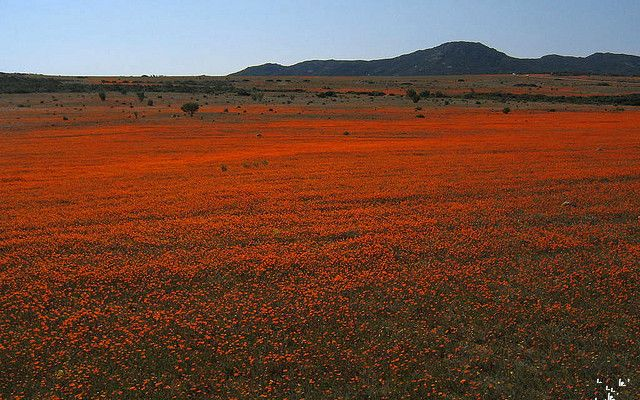

进阶应用
==========

图片和主题
----------
如果需要围绕图片展开一个主题，那么使用 *figure* 命令是一个很好的选择。
可以方便的为图片加入简洁的文字说明，和详细的图片故事。

  美丽的纳马夸兰

  纳马夸兰是最著名的赏花圣地。在春天到来时,这个半沙漠地区忽然魔术般地变成花的海洋，方圆几十公里内全都是番杏科的植物盛开着紫红、金黄、粉红、橘红色的花朵，视野里只有色彩，整个世界中好像只有花存在。

.. code-block:: none
  :linenos:
  :lineno-start: 0
  
  .. figure:: _static/namakualan.jpg
    :scale: 80%
    :align: left
    :alt: Scene of Namaqualand
    
    美丽的纳马夸兰
  
    纳马夸兰是最著名的赏花圣地。在春天到来时,这个半沙漠地区忽然魔术般地变成花的海洋，
    方圆几十公里内全都是番杏科的植物盛开着紫红、金黄、粉红、橘红色的花朵，视野里只有
    色彩，整个世界中好像只有花存在。  

figure指令不支持图片自动编号。Sphinx没有提供该功能，需要自己扩展。

借用Linux内核中的扩展
----------------------
Linux内核中的Documentation部分对Sphinx进项了扩展，提供了更多好用的标签，借用Linux内核来生成
自己的文档，效果非常好，它特别针对源码注释生成文档进行了优化。

在readthedocs中显示
--------------------

https://readthedocs.org 是一个第三方免费的文档托管网站，可以直接从github等源码服务器上拉取项目，并自动生成
html文件方便浏览和外部引用。

附录
======

参考网站
--------
- Sphinx的中文文档：https://zh-sphinx-doc.readthedocs.io/en/latest/contents.html
- reST: http://docutils.sourceforge.net/rst.html
- Sphinx对reST的扩展： http://www.sphinx-doc.org/en/master/usage/restructuredtext/index.html
- Linux内核中Sphnix的应用：https://www.kernel.org/doc/html/latest/doc-guide/index.html
